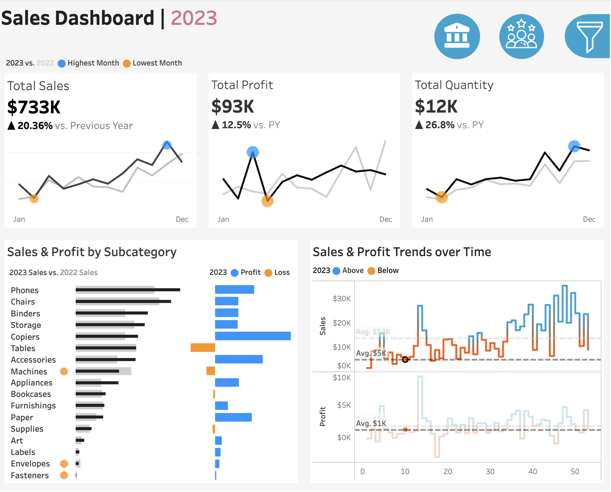

  |    |    |  

# Data Scientist | Data Analyst
Welcome to my page!

## Education
- M.S., Business Analytics	| The University of California, Davis (_2024_)	 		       		
- B.S., Finance | The Pennsylvania State Univeristy (_2019_)

### Technical Skills
- **Machine Learning**: sklearn, TensorFlow, PyTorch, Data Modeling
- **Statistical Exploration**: A/B Testing, Time Series Analysis, Multivariate Analysis
- **Database Management**: NoSQL
- **Data Visualization**: Tableau, PowerBI
- **Web Scraping**: BeautifulSoup, Selenium
- **Supply Chain Management**: SAP
- **Cloud Computing**: AWS, GCP
- **Big Data Analytics**: Hadoop, Spark, Kafka

### Programming and Tools
- Python, SQL, Microsoft Excel, R
- GA4, Java, Apache Spark, AWS Redshift

## Projects
Here are some of the projects I've worked on, which reflect my skills and dedication to my field:

- [Sales Performance Dashboard](https://public.tableau.com/views/SalesPerformance_17191078268250/Salesdahsboard?:language=en-US&:sid=&:display_count=n&:origin=viz_share_link)

- [Ozempic's effects on patient health](https://github.com/KawehiW/Ozempic)

- [Fine-tuning large language model](https://github.com/KawehiW/Fine-Tuning-LLM)

